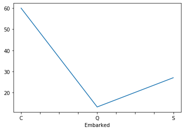

```python
import os

import pandas as pd
import matplotlib.pyplot as plt
import numpy as np

import micplot
```

# Installation
`micplot` can be installed by forking this repository and running `pip install micplot` in the appropriate folder

# More effective visualization in one line of code
Pandas is  an extremely popular python package for data manipulation, and for good reason: it has a host of possibilities. However, it's out-of-the-box plotting options usually result in hard to interpret plots. This is unfortunate, because good visualization leads to better discussion with and more insights from subject matter experts, which is sorely needed for useful data analytics


```python
df = pd.read_csv(os.path.join('data', 'titanic.csv'))
```


```python
data = df.groupby('Embarked')['Fare'].mean()
data.plot() 
plt.show()
```


    

    


Indeed, the plot is difficult to interpret. A line plot is not a logical choice for this type of data, and there are meaningless ticks.

Therefore, the `micplot` package was developed, with three advantages:
  1. It automatically makes choices that make the plot much easier to interpret
  1. It makes the up the plot area nicely, by removing fluff, so it is easer to read.
  1. It is fully customizable if something is not to your wishes
  
## Creating focus
In plotting, it is important to make clear what the point of the plot is. `micplot` does this in two ways:
1. From the data, it infers a focus point, by sorting and highlighting data, and  
1. It makes the plot clearer, by annotating when necessary and removing fluff, such as unnecessary ticks and the frame.


```python
vis = micplot.visualize(data)
plt.show()
```


    

    


## The plot is still fully customizable
If the plot is not fully to your liking, the `Visualization` object that is returned contains all choices as attributes, including the axis, which can still be altered. In the example below, we alter the plottype and the bars which are highlighted. Other options that can be altered are in the documentation.


```python
vis = micplot.visualize(data, plottype='vertical_bar', highlight=[0, 1])
vis.ax.set_ylabel('Mean ticket price')
plt.show()
```


    

    


```python
?vis
```


    Type:           Visualization
    String form:    <micplot.visualization.Visualization object at 0x000001D4E35F7888>
    File:           c:\users\gebruiker\documents\willekeurige berekeningen\micplot\visualization.py
    Docstring:     
    Visualizes the data and hold all choices as attributes.
    
    Fully customizable through its iniatilization and its attributes
    Init docstring:
    Initialize the visualization.
    
    Parameters
    ----------
    data : pd.Series or pd.DataFrame
        The data that is to be visualized
    plottype : str, optional
        The type of plot to use, one of ["bar", "waterfall", "vertical_bar",
        "line", "scatter", "bubble", "pie" or "composition_comparison"].
        By default, this is inferred from the data(type)
    highlight : iterable, optional
        Iterable of indices of the values which should be highlighted. By default, is top value
    highlight_color : str, optional
        Color str in which to highlight some values. The default is defaults.HIGHLIGHT_COLOR.
    highlight_type : str, optional
        Whether to highlight "row" or "column". By default, this is determined from the data
    sorting : str, optional
        Whether and how to sort the data. By default, is determined from type data
    annotated : bool, optional
        Whether values should also be displayed in text. By default, this is
        inferred from the data
    strfmt : str, optional
        The format string, how to annotate the data. By default, this is inferred 
        from the data type
    
    Raises
    ------
    TypeError
        If data is not of type pd.Series or pd.DataFrame
    


# `micplot` contains some more useful plottypes
Above, we already saw the bar chart that is often very useful to make a point. Below, we show other plottypes and when `micplot` uses them.

## Waterfall charts for compositions
Waterfall charts are a good choice to show how the total group composition is. Note how `micplot` automatically infers this from the fact that the data contains percentages that add up to 100%.


```python
data = df['Embarked'].value_counts(normalize=True)
micplot.visualize(data)
```


    <micplot.visualization.Visualization at 0x1d4e365b448>


    

    


## Vertical bars for short timeseries data
Bar charts are the plot of choice for time series data with not too many points. `micplot` infers this from the Index of the data. Note how in the plot below the legend is placed outside the plot to prevent the legend from overlapping with the data. The highlight specifies that data point to highlight if there is only one Series, but the column to highlight if multiple Series are compared.


```python
size = 6
columnnames = ['Cars', 'Bikes', 'Buses', 'Planes']
test_data = pd.DataFrame(10*np.random.rand(size, 4), index=pd.date_range('20190101', periods=size), columns=columnnames)
```


```python
micplot.visualize(test_data['Cars'], highlight=-1)
plt.show()
micplot.visualize(test_data, highlight=0)
plt.show()
```


    

    


    

    


## Line chart for longer timeseries data
The bar chart would become unreadable if the time series data were longer, so `micplot` changes the plottype to a line plot.


```python
size = 12
test_data = pd.DataFrame(10*np.random.rand(size, 4), index=pd.date_range('20190101', periods=size), columns=columnnames)

micplot.visualize(test_data['Cars'], highlight=-1)
plt.show()
micplot.visualize(test_data, highlight=0)
plt.show()
```


    

    


    

    


## Scatter plots to investigate the relationship between two series


```python
micplot.visualize(df[['Age', 'Fare']])
plt.show() 
```


    

    


If there are only a few datapoints in the plot, the points are also labeled with their index.


```python
micplot.visualize(df[['Age', 'Fare']].sample(15))
plt.show() 
```


    

    


If there is a third column, this is turned into a bubble chart, where the third column determines the marker size


```python
micplot.visualize(df[['Age', 'Fare', 'Parch']])
plt.show() 
```


    

    


## Composition comparison can show how subpopulations differ
Stacked bar charts can easily show whether subgroups have the same distributions. `micplot` automatically uses this plottype if the input data are columns where each column contains percentages.


```python
data = (df.groupby('Pclass')['Survived'].value_counts(normalize=True)
        .unstack(level='Pclass')
       )

```


```python
vis = micplot.visualize(data)
```


    

    


## Pie chart works as expected


```python
micplot.visualize(df['Embarked'].value_counts(), plottype='pie')
```


    ---------------------------------------------------------------------------

    TypeError                                 Traceback (most recent call last)

    <ipython-input-30-1097c721adaa> in <module>
    ----> 1 micplot.visualize(df['Embarked'].value_counts(), plottype='pie')
    

    ~\Documents\Willekeurige berekeningen\micplot\visualization.py in visualize(data, **kwargs)
        681     """
        682     vis = Visualization(data, **kwargs)
    --> 683     vis.plot()
        684     return vis
        685 
    

    ~\Documents\Willekeurige berekeningen\micplot\visualization.py in plot(self)
        626         color = self._define_colors()
        627         linestyles = self._define_linestyles()
    --> 628         self.ax = plotter(self._data_to_plot, color=color, style=linestyles, ax=self.ax)
        629 
        630         if self.annotated:
    

    ~\Documents\Willekeurige berekeningen\micplot\plotfunctions.py in plot_pie(data, **kwargs)
        119 def plot_pie(data, **kwargs):
        120     """ Plot pie chart - small joke."""
    --> 121     raise TypeError('A pie chart? Are you kidding me?')
        122 
        123 def plot_composition_comparison(data, **kwargs):
    

    TypeError: A pie chart? Are you kidding me?


    

    

